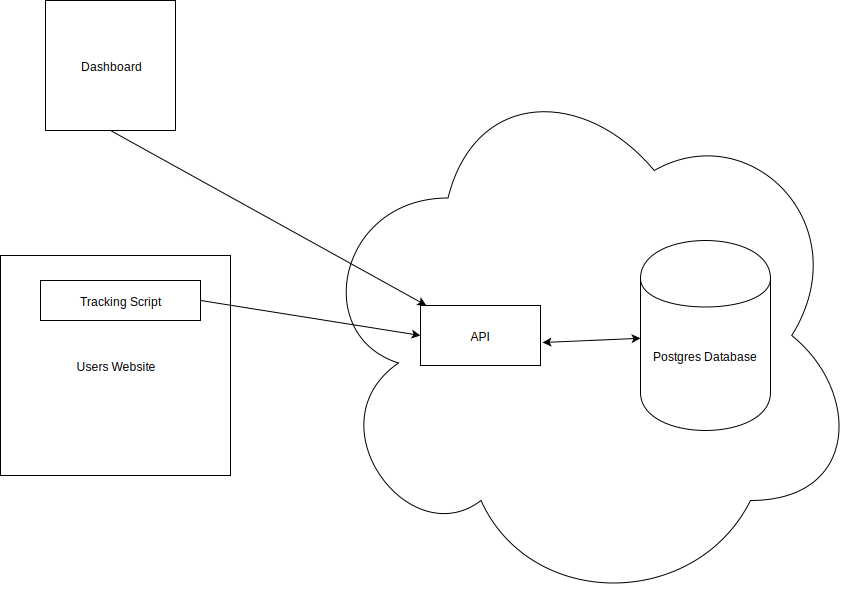

# Freelytics

**Freelytics provides free and privacy respecting analytics for your blog or small website, for FREE!**

The idea behind the architecture is simple.

Provide an API to store some information that comes from website.
Store this data inside a Database and then display it a later point via a Dashboard.

 

## What is tracked?
- total visitors per URL (**be aware**: Parameters are stripped from URLs)

## Why write this?
I host a blog myself and wanted to get some insights about how people are using it.
All options that were available to me at the time required complex setup for their users, cost money or used techniques that were not respectful of data privacy and therefore our internet.

Its a passion project, and hopefully one that you can enjoy as well.

## How to use this?
Just head over to [https://freelytics.net](https://freelytics.net) and follow these steps:

1. Create a tracking script for your website at [https://freelytics.net/generate-tracking-script](https://freelytics.net/generate-tracking-script).
2. Paste this into your website. Wordpress and Ghost provide easy ways to do this. Simply google `insert script into wordpress`/`insert script into ghost cms` respectively.
3. Now head back to [https://freelytics.net](https://freelytics.net) and enter the URL oy your website and press `Get Data`. If you do not see and data just yet, simply visit your own blog and then try again.

## Can I host it myself?
Sure! 

The docker images are hosted here:
- API: bmff/analyze-api:latest
- Frontend: bmff/analyze-frontend:latest

TODO:
Write documentation about how to deploy the different parts, and all parts together with `docker-compose`.

## Who owns the data?
The data is stored in a Postgres Database that I am hosting for now. I will provide dumps of the data though. 
Just contact me via my [blog](https://maximilianehlers.com) and I will send you only your data, or all of it.

None of it is identifying anyone! And I will do all I can to keep it this way.
The idea is to be 100% transparent and provide a service that we can all benefit from.

In the long term I would like to make even the database public with a special user account, so that anyone can use the data for research or visualization, so that they can share insights or just learn something.

## Contributing

All contributions are welcome. I have created some issues that I think need work.
If you have other ideas feel free to create an issure to discuss them or heck, if you know how to implement them why not go ahead and then create a PullRequest. 

Any level of expertise is welcome, and even if you dont have any but want to help out and need some mentorship Im happy to help out.

